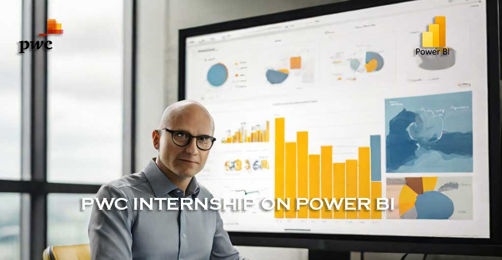
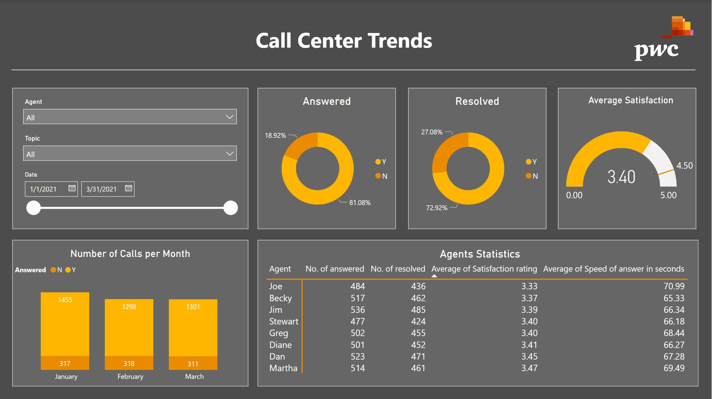
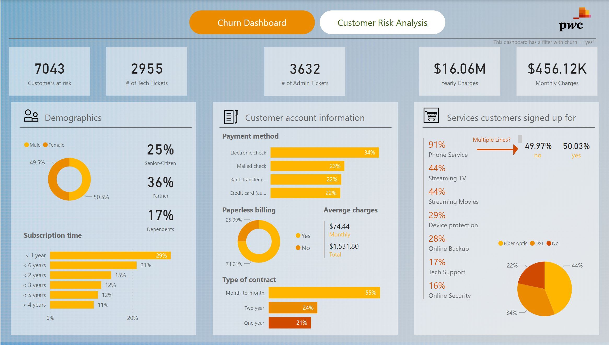
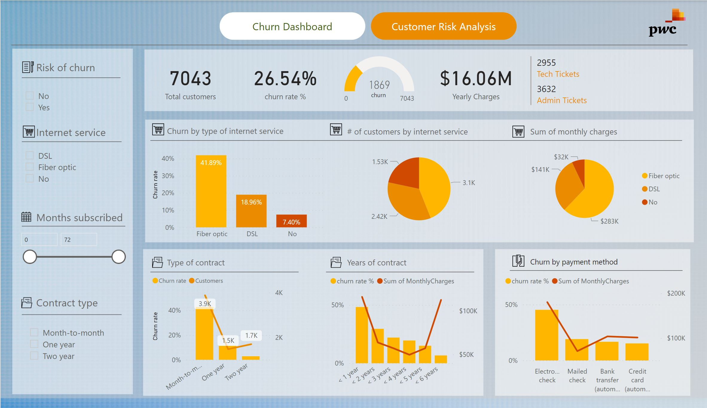

# PWC-Internship-on-Power-BI

## Overview

This GitHub repository encompasses a virtual experience where team members assist clients in resolving critical issues through technology-driven solutions. The primary tool utilized in this project is Power BI, employed for data cleaning, wrangling, and visualization to enhance the client's understanding of their customer base and internal workforce.

## Project Details

**Objective:** Helping clients comprehend their customers and employees better through data analysis using Power BI.

**Team Collaboration:** Collaboration with a proficient team to address the client's needs and deliver optimal solutions.

### Assignments:

**Call Center Assignment:** Assisting the retention manager in identifying employees and clients contemplating leaving the company.

**HC Program Engagement:** Engaging in a large-scale program focusing on diversity and inclusion, supporting executives in gaining insights into this important subject.

Client Challenges: Acknowledging that change can be challenging for clients, but believing it drives innovation and the discovery of effective solutions.

## Assignment 1:  Call Centre

### Task 1

Claire, the Call Centre Manager at PhoneNow, seeks a comprehensive overview of critical Key Performance Indicators (KPIs) and metrics related to the Call Centre's operations. She desires transparency and insights into various aspects such as total calls answered and abandoned, speed of answer, call duration, overall customer satisfaction, and more. Claire is interested in visualizing long-term trends in customer and agent behavior to facilitate discussions with the management team. The task involves creating a Power BI dashboard that effectively displays relevant KPIs and metrics extracted from the dataset provided by Claire, aiming to offer a clear and insightful representation of Call Centre trends. The dashboard will serve as a basis for meaningful discussions and decision-making within the management team.

### Cleaning / Data Wrangling
- The "Answered" column has a value of "N" (indicating the call was not answered), it's expected and normal to have null values for "Speed of answer in seconds", "Avg Talk Duration", and "Satisfaction rating" since these metrics don't apply to unanswered calls. In this case, leaving these fields as null is appropriate as it accurately represents the absence of data due to the unanswered call.
- The dataset was then sorted by the "Answered" column from lowest to highest (sort A to Z)
- The "AvgTalkDuration" Column was converted from minutes to seconds and the column name was changed to "AvgTalkDuration in seconds" for better analysis
- There were no duplicate entries and all columns were well formatted with the correct data types.

### Analysis and Visualization
- New calculated measure for No. of Answered calls was calculated with DAX using ***No. of answered = Calculate(distinctcount('Call Center'[Call Id]),Filter('Call Center','Call Center'[Answered (Y/N)]="Y"))***
- New calculated measure for No. of Resolved calls was calculated with DAX using ***No. of resolved = Calculate(distinctcount('Call Center'[Call Id]),Filter('Call Center','Call Center'[Resolved]="Y"))***
- New Calculated measure for ***Target Satisfaction = 4.5*** was calculated using DAX

- Below is the Power BI visuals created:

### Task 2

Following the successful creation and presentation of a customer-centric dashboard to the management, the telecom's Retention Manager reached out to request a dashboard focusing on customer retention. They aim to proactively identify customers at risk of terminating their contracts rather than reacting after contract termination. The Retention Manager emphasizes the importance of retaining hard-earned customers and the current limitations in analyzing customer data using Excel, seeking a clearer, self-explanatory visual representation for effective management understanding. Additionally, a meeting with the engagement partner at PwC is scheduled to discuss the significance of customer retention and the need for predictive analysis to preemptively address potential contract terminations. The retention manager has provided initial information to aid in this endeavor. The task involves creating a new dashboard focusing on customer retention metrics and insights, aligning with the telecom's proactive approach to prevent customer churn. Additionally, it involves summarizing findings and suggesting necessary changes based on the dashboard's insights in an email to the engagement partner at PwC.

***The Dataset was clean and well-transformed so i went straight to visualization***

### Analysis and Visualization

A two-page visualization report had to be made to give a well-detailed report.

**Visualization 1: Churn Dashboard**

**Visualization 2: Custumer Risk analysis**

.
An email was sent to the engagement partner with the following insights and recommendations:

**Here are some insights from the Analysis:**

- The dataset is balanced in terms of gender with 3555 males and the rest females.
- Most customers are not senior citizens, with only about 16.2% being senior citizens.
- Most customers do not have partners or dependents.
- The average tenure of a customer with the company is approximately 32.37 months, with a maximum of 72 months.
- Most customers have phone service, and among those who do, most do not have multiple lines.
- The most common type of internet service is Fiber optic.
- Most customers do not have online security, online backup, device protection, tech support, streaming TV, or streaming movies.
- The most common contract type is month-to-month.
- Most customers have opted for paperless billing.
- The most common payment method is “electronic check”.
- The average monthly charge is approximately 64.76, with a maximum of 118.75.
- The average number of administrative and technical tickets a customer raises is approximately 0.52 and 0.42 respectively.
- The majority of customers have not churned.

**Recommendations:**

- The company could focus on promoting online security, online backup, device protection, tech support, streaming TV, and streaming movies as these services are not widely used by the customers.
- The company could consider offering more incentives for customers to opt for longer-term contracts as most customers are on a month-to-month contract.
- The company could look into offering more payment options as the majority of customers use electronic checks, which may not be the most convenient method for everyone.
- The company could investigate why the churn rate is high and take appropriate measures to improve customer retention.

